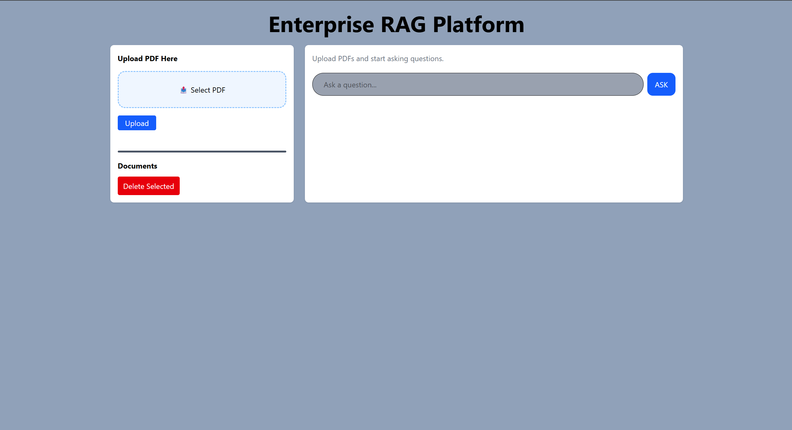
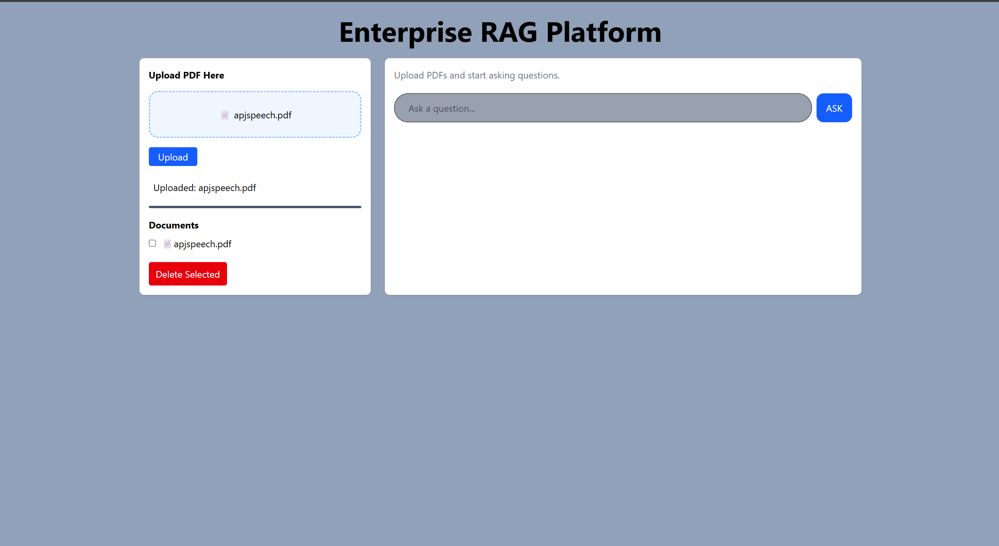
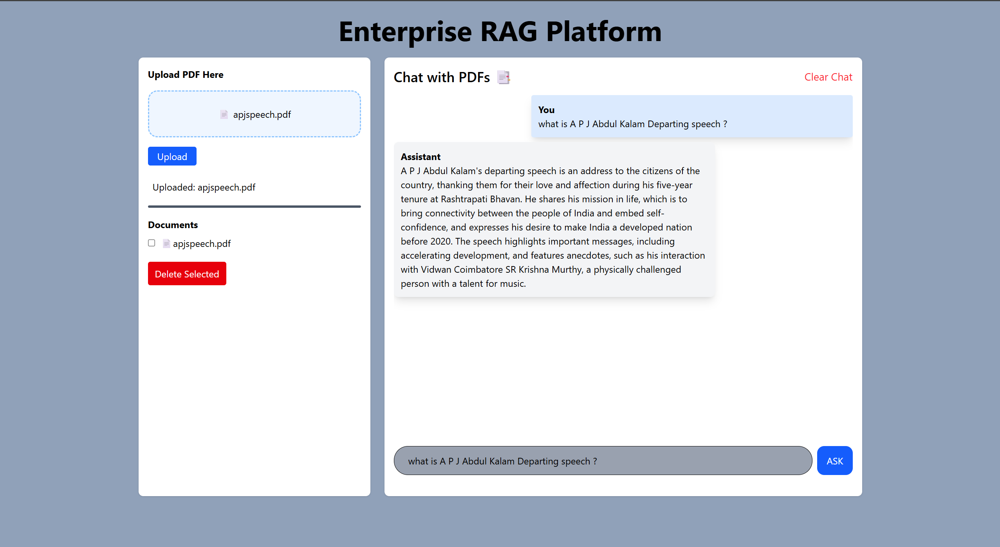

# Enterprise RAG Platform

A production-ready Retrieval-Augmented Generation (RAG) application that enables users to upload PDF documents and ask natural language questions based on their content.

## Live Demo

**Frontend:** https://enterprise-rag-platform-chi.vercel.app/

**Backend API:** https://enterprise-rag-platform-backend.onrender.com

---

## Application Preview

### Home Page



### Upload Document



### Question Answering



## Overview

Enterprise RAG Platform allows users to:

* Upload PDF documents
* Automatically process and chunk documents
* Generate semantic embeddings
* Store embeddings in a vector database
* Retrieve relevant document context
* Ask questions in natural language
* Receive context-aware answers powered by an LLM

The system uses Retrieval-Augmented Generation (RAG) to provide accurate answers grounded in uploaded documents.

---

## Features

* PDF Upload & Processing
* Semantic Search using Embeddings
* Vector Database Storage
* Context-Aware Question Answering
* Multi-Document Support
* Document Management
* FastAPI Backend
* React Frontend
* Dockerized Deployment
* Cloud Deployment (Vercel + Render)

---

## Architecture

```text
User
 │
 ▼
React Frontend (Vercel)
 │
 ▼
FastAPI Backend (Render)
 │
 ├── PDF Upload
 │
 ├── Document Chunking
 │
 ├── HuggingFace Embeddings
 │
 ├── Chroma Vector Database
 │
 └── LangChain Retrieval
         │
         ▼
     Groq LLM
         │
         ▼
      Response
```

## Tech Stack

### Frontend

* React
* Vite
* Tailwind CSS
* Axios / Fetch API

### Backend

* FastAPI
* LangChain
* Groq
* ChromaDB
* HuggingFace Embeddings
* PyPDF

### Deployment

* Docker
* Render
* Vercel

---

## Workflow

### Document Ingestion

1. Upload PDF
2. Extract text from PDF
3. Split document into chunks
4. Generate embeddings
5. Store vectors in ChromaDB

### Question Answering

1. User submits a query
2. Relevant chunks are retrieved
3. Retrieved context is sent to the LLM
4. LLM generates an answer grounded in the document

---

## API Endpoints

### Upload Document

```http
POST /upload
```

### Ask Question

```http
POST /chat
```

### List Documents

```http
GET /documents
```

### Delete Document

```http
DELETE /documents/{filename}
```

---

## Local Setup

### Clone Repository

```bash
git clone https://github.com/vishal-chaudhary23/enterprise-rag-platform.git
cd enterprise-rag-platform
```

### Backend Setup

```bash
cd backend

python -m venv venv

venv\Scripts\activate

pip install -r requirements.txt
```

Create `.env`

```env
GROQ_API_KEY=your_api_key
```

Run Backend

```bash
uvicorn app.main:app --reload
```

### Frontend Setup

```bash
cd frontend

npm install

npm run dev
```

---

## Docker

Build and Run

```bash
docker compose up --build
```

---

## Challenges Solved

* Dockerizing FastAPI + LangChain applications
* Reducing Docker image size from 8.86 GB to 2.28 GB
* CPU-only PyTorch optimization
* CORS configuration for Vercel and Render deployments
* Production deployment of a full-stack AI application
* Vector database persistence and retrieval

---

## Future Improvements

* Streaming LLM responses
* User Authentication
* Multi-user document isolation
* Cloud Vector Database Integration (Pinecone)
* Hybrid Search (BM25 + Dense Retrieval)
* Knowledge Graph Integration
* Citation-based Answers

---

## Author

**Vishal Chaudhary**

GitHub: https://github.com/vishal-chaudhary23

LinkedIn: https://www.linkedin.com/in/vishal-chaudhary-8996a2366/
